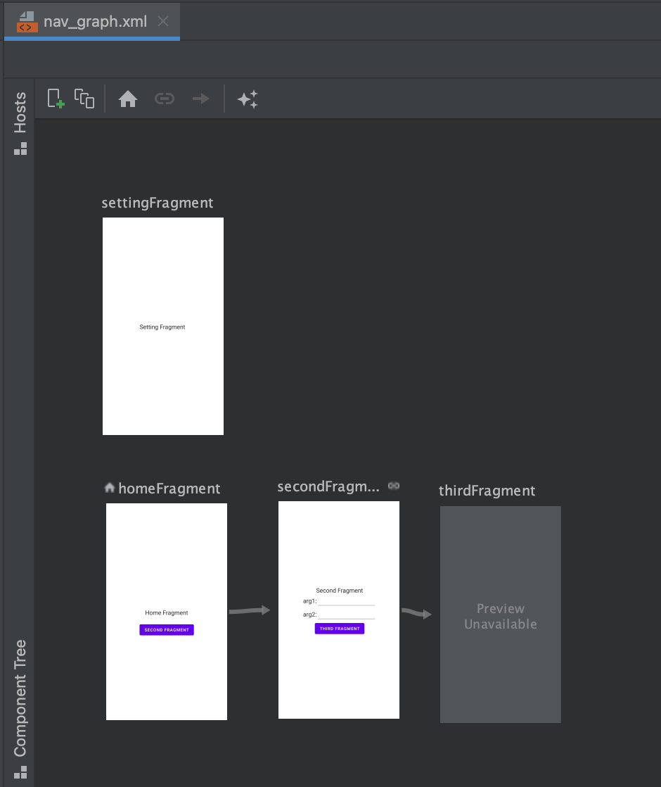

# navigation-app

- 這是一個用來練習Jetpack的專案。

  後來的Android專案以這個專案為基礎架構，用來管理切換頁面。

  It's a sample to practice Navigation component from Jetpack libraries.


- 環境
  - [build.gradle](build.gradle)

    如需在目的地之间导航，建议使用 Safe Args Gradle 插件。此插件可生成简单的对象和构建器类，以便在目的地之间实现类型安全的导航。

    ```
    ext.nav_version = "2.3.0"

    dependencies {
      classpath "androidx.navigation:navigation-safe-args-gradle-plugin:$nav_version"
    }
    ```

  - [build.gradle](app/build.gradle)
    
    enable plugin:
  
    ```
      apply plugin: 'androidx.navigation.safeargs.kotlin'
    ```
  
    添加以下依賴項:

    ```
      def nav_version = "2.4.1"
    
      // Kotlin
      implementation "androidx.navigation:navigation-fragment-ktx:$nav_version"
      implementation "androidx.navigation:navigation-ui-ktx:$nav_version"
    ```
    

- 設計導航圖
  - [nav_graph.xml](app/src/main/res/navigation/nav_graph.xml)
  
    透過圖形化元件添加跳轉頁的Action
  
    

  - 右邊屬性可以設定動畫
    
    enterAnim 代表新頁進入的動畫

    exitAnim 代表舊頁離開的動畫

    popEnterAnim 代表新頁離開的動畫

    popExitAnim 代表舊頁進入的動畫
  
    

  
- Rebuild
  - 因為在compile time會產生額外的code, 可以方便使用剛剛在導航圖規劃的動作


- 跳頁
  - [HomeFragment.kt](app/src/main/java/com/example/navigation_example/HomeFragment.kt)
    ```
    // Rebuild後，插件在編譯時會產生對應的代碼
    val action = HomeFragmentDirections.actionHomeFragmentToSecondFragment()

    // 导航到目的地是使用 NavController 完成的，它是一个在 NavHost 中管理应用导航的对象。
    // 调用 navigate() ，以在各个目的地之间导航。
    findNavController().navigate(action)
    
    ```


- 參數 
  - 右邊屬性可以設定參數
  
  
  
  - [SecondFragment.kt](app/src/main/java/com/example/navigation_example/SecondFragment.kt)
  ```
    // 跳頁動作代入參數
    val action = SecondFragmentDirections.actionSecondFragmentToThirdFragment(username, password)
    findNavController().navigate(action)  
  ```
  

- ActionBar & Toolbar
  - [themes.xml](app/src/main/res/values/themes.xml)
  
    需要移除theme預設的Action Bar
    ```
      <!-- Base application theme. -->
      <style name="NavigationApp" parent="Theme.MaterialComponents.DayNight.NoActionBar">
    ```

  - [activity_main.xml](app/src/main/res/layout/activity_main.xml)
    
    在畫面中加入自定義的ToolBar
    ```
      <androidx.appcompat.widget.Toolbar
        android:id="@+id/toolbar"
        android:theme="@style/ThemeOverlay.AppCompat.Dark.ActionBar"
        ... />
    ```

  - [MainActivity.kt](app/src/main/java/com/example/navigation_example/MainActivity.kt)
  
    ```
      setSupportActionBar(toolbar)
    ```

  - [nav_graph.xml](app/src/main/res/navigation/nav_graph.xml)
  
    NavigationUI uses the destination labels from your navigation graph to keep the title of the top app bar up-to-date.

    ```
      <navigation>
        <fragment ...
                android:label="{username}">
        ...
        </fragment>
      </navigation>
    ```
  
  - [options_menu.xml](app/src/main/res/menu/options_menu.xml)
    使用Menu, 
    預設是點選menu切換到Settings頁面, 返回到根頁面Home.

    ```
    <menu ...>
      <item
          android:id="@+id/settingFragment"
          android:title="Settings"
          android:menuCategory="secondary"
          app:showAsAction="never" />
      <item
          android:id="@+id/termsFragment"
          android:title="Terms"
          app:showAsAction="never" />
    </menu>
    ```
    
    若想返回到上一頁可加入：
  
    ```
      android:menuCategory="secondary"
    ```

    或者在graph加入global action, TermsFragment為例
    ```
      <action android:id="@+id/action_global_termsFragment" app:destination="@id/termsFragment"/>
    ```
  
  - [MainActivity.kt](app/src/main/java/com/example/navigation_example/MainActivity.kt)
    須設定自定義的menu，並且讓TermsFragment跳至上一頁
    ```
      override fun onCreateOptionsMenu(menu: Menu?): Boolean {
          menuInflater.inflate(R.menu.options_menu, menu)
          return true
      }
  
      override fun onOptionsItemSelected(item: MenuItem): Boolean {
          return item.onNavDestinationSelected(navController) || super.onOptionsItemSelected(item)
      }
    ```


- BottomNavigationView

  - [options_menu.xml](app/src/main/res/menu/options_menu.xml)
    
    為底部導航欄設置menu
  
  - [activity_main.xml](app/src/main/res/layout/activity_main.xml)
  
    Activity新增BottomNavigationView並設定menu

    ```
        <com.google.android.material.bottomnavigation.BottomNavigationView
            android:id="@+id/bottom_nav"
            android:layout_width="match_parent"
            android:layout_height="wrap_content"
            android:layout_alignParentBottom="true"
            app:menu="@menu/bottom_nav_menu"/>
    ```
  
  - [MainActivity.kt](app/src/main/java/com/example/navigation_example/MainActivity.kt)
  
    ```
          // 為底部導航欄設置Actionbar配置、NavController
          appBarConfiguration = AppBarConfiguration(
              setOf(R.id.homeFragment, R.id.settingFragment)
          )
          bottom_nav.setupWithNavController(navController)
    ```
    

- Navigation Drawer
  - [activity_main.xml](app/src/main/res/layout/activity_main.xml)
    
    將DrawerLayout擺在最外層，注意其特性是Layout內只能放兩個View
    
    ```
      <androidx.drawerlayout.widget.DrawerLayout 
    ```
  
    所以我們用一個Layout將主要內容包起來做為第一個View，第二個View為抽屜的畫面，即NavigationView
    ```
      <com.google.android.material.navigation.NavigationView
          android:id="@+id/nav_view"
          android:layout_width="wrap_content"
          android:layout_height="match_parent"
          android:layout_gravity="start"
          app:menu="@menu/bottom_nav_menu" />
    ```
  
  - [MainActivity.kt](app/src/main/java/com/example/navigation_example/MainActivity.kt)
    
    在appBarConfiguration要特別設置drawer的id(drawer_layout)
    ```
      appBarConfiguration = AppBarConfiguration(
        setOf(R.id.homeFragment, R.id.settingFragment),
        drawer_layout
      )
    ```
    
    將appBarConfiguration配置到navigete up函式中，讓漢堡icon可以啟用功能
    ```
      override fun onSupportNavigateUp(): Boolean {
          return navController.navigateUp(appBarConfiguration) || super.onSupportNavigateUp()
      }
    ```


- 創建隱式深層鏈接 Implicit Deep Links
  透過瀏覽器連結，直接開啟application的指定fragment
  
  <video width="600" height="600" controls>
    <source src="Docs/Image/ImplicitDeepLinks.mov" type="video/mp4">
  </video>
  
  - [nav_graph.xml](app/src/main/res/navigation/nav_graph.xml)
    先設定Deep Links和參數
    
    

  - [MainActivity.kt](app/src/main/AndroidManifest.xml)
    manifest.xml 文件中添加內容，將一個 <nav-graph> 元素添加到指向現有導航圖的 Activity
    
    
- Reference
  
  1. 官網：https://developer.android.com/guide/navigation/navigation-getting-started?hl=zh-cn

  2. 在Fragment、Activity 或View, 可以取得NavController來存取nav_graph定義的操作： 
  https://developer.android.com/guide/navigation/navigation-navigate?hl=zh-cn#groovy

  4. 參考其他Youtuber：https://github.com/codinginflow/NavigationComponentTutorial